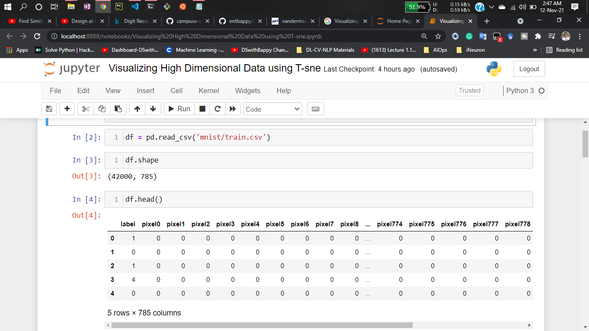
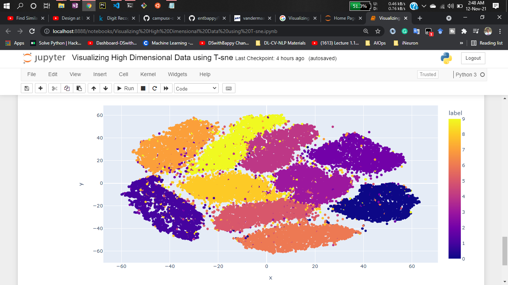

# Visualizing High Dimensional Data using t-SNE

Visualization of high-dimensional data is an important problem in many different domains, and
deals with data of widely varying dimensionality. Cell nuclei that are relevant to breast cancer,
for example, are described by approximately 30 variables (Street et al., 1993), whereas the pixel
intensity vectors used to represent images or the word-count vectors used to represent documents
typically have thousands of dimensions. Over the last few decades, a variety of techniques for
the visualization of such high-dimensional data have been proposed, many of which are reviewed
by de Oliveira and Levkowitz (2003). 

Important techniques include iconographic displays such as
Chernoff faces (Chernoff, 1973), pixel-based techniques (Keim, 2000), and techniques that represent the dimensions in the data as vertices in a graph (Battista et al., 1994). Most of these techniques simply provide tools to display more than two data dimensions, and leave the interpretation of the data to the human observer. This severely limits the applicability of these techniques to real-world data sets that contain thousands of high-dimensional datapoints.

Researchers present a new technique called “t-SNE” that visualizes high-dimensional data by giving each datapoint a location in a two or three-dimensional map.

## Experimentation of this Algorithm:

Here I have used MNIST Handwritten dataset. You can see it is a higher dimentional data

After applying the algorithm you can see the result & visualization

## Paper about “t-SNE”:
 - [Paper link](https://www.jmlr.org/papers/volume9/vandermaaten08a/vandermaaten08a.pdf)

## Video Lecture “t-SNE”:
 - [Lecture link](https://www.youtube.com/watch?v=EMD106bB2vY)

## Dataset has been used:
 - [Data link](https://www.kaggle.com/c/digit-recognizer/data)

